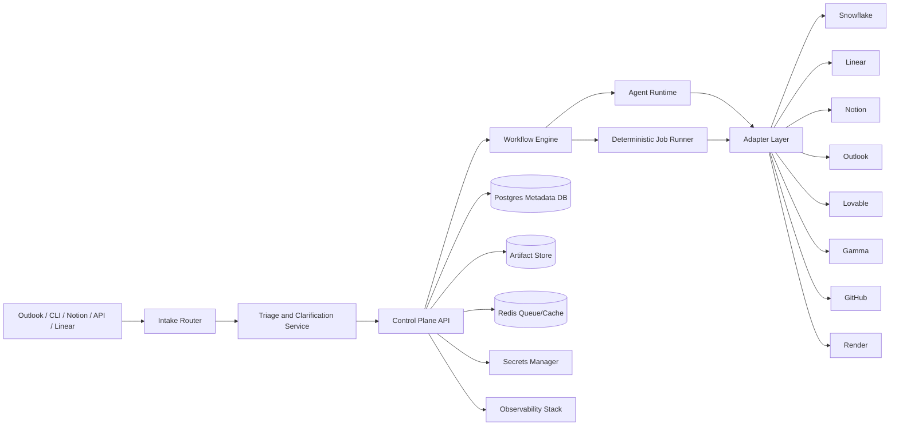

# OMDT: One Man Data Team
## Product Requirements Document + Implementation Specification

**Version:** v0.3  
**Status:** Draft for implementation  
**Date:** March 29, 2026  
**Primary stack:** Python-first  
**Intended readers:** Founder, Claude Code / coding agent, engineering contributors, data stakeholders, future operators

---

## Executive Summary

OMDT (One Man Data Team) is an open-source, Python-first operating framework that behaves like an in-house data team. It is designed to let a single operator or very small team intake requests, clarify requirements, draft PRDs, manage stakeholders, build and monitor data pipelines, provision warehouse access, produce analyses, summarize research papers, create high-quality written outputs, onboard people to the platform and connected tools, publish dashboards and decks, sync everything to Linear, and maintain a strong audit trail across every meaningful action.

The product is intentionally **not** a loose swarm of autonomous agents. It is a **manager-led control plane** with specialist agents operating inside explicit policies, well-defined tool adapters, deterministic execution services, and a common metadata model. Agents are responsible for planning, analysis, routing, summarization, recommendation, and coordination. Deterministic services are responsible for job execution, provisioning, scheduling, deployment, testing, and state synchronization.

This revision adds eight critical capabilities that must be considered core to V1:

1. **Triage and Clarification Agent**  
   OMDT must include a dedicated intake and triage role that can iteratively converse with users through email, Linear comments, Notion pages, CLI prompts, or API messages. This agent is responsible for converting ambiguous requests into structured work items and driving the PRD drafting/review loop until the project is approved or archived.

2. **Linear-Connected Operating Model**  
   Every human-visible project, work item, clarification thread, incident, deployment, and milestone must be connected to Linear. OMDT remains the canonical source of state, but Linear becomes the universal collaboration mirror for project execution and stakeholder visibility.

3. **Strong Logging and Audit Layer**  
   Every important action must emit structured logs, domain events, traces, and append-only audit entries. The audit system must record who initiated an action, which agent/prompt/version ran, what tools were called, what artifacts changed, and whether approvals were present.

4. **Academic Research Agent**  
   OMDT must include an academic agent capable of ingesting papers, extracting metadata, summarizing methods and findings, building literature matrices, and producing structured research briefs that feed model planning and complex data science initiatives.

5. **Python-Only Core Implementation Standard**  
   The control plane, adapters, scheduler interfaces, config validation, tests, and core worker runtime must all be implemented in Python to keep the system maintainable, hackable, and easy to extend.

6. **Technical Writer Agent**  
   OMDT must include a dedicated technical writing role that can transform approved analyses, architecture changes, pipeline releases, incidents, and platform changes into crisp outputs for the right audience: executive briefings, technical memos, SOPs, runbooks, release notes, onboarding guides, and user-facing help material.

7. **Training and Enablement Agent**  
   OMDT must include a dedicated training role that can onboard new users to the OMDT OS itself and to connected tools such as Snowflake, Linear, Notion, Lovable, Gamma, and GitHub workflows. This role must generate role-based learning paths, setup checklists, FAQs, labs, and adoption follow-up plans.

8. **Component-Level Unit Test Discipline**  
   OMDT must explicitly require unit tests for individual components, not only broad workflow tests. Every agent service, adapter, router, schema, config loader, workflow transition, audit utility, and security policy must ship with isolated tests so Claude Code or any coding agent can safely evolve the codebase without regressing core behavior.

OMDT should start with Snowflake as the primary warehouse, Lovable for internal dashboards/status interfaces, Gamma for decks/briefings, Notion for collaborative PRDs, Linear for the execution board, Outlook for intake and outbound communication, GitHub Actions for CI/CD and selected schedules, Render for hosting and recurring jobs, and DBML/dbdiagram for data models and diagrams.

The key implementation principle is simple: **everything becomes a typed work item with a lifecycle, every lifecycle change emits events, every event is logged, and every human-facing work item is mirrored to Linear**.

### Executive SMART Outcomes

The first production release of OMDT should meet these SMART outcomes:

1. **Structured intake coverage**  
   At least 90% of incoming requests from configured channels are converted into structured work items with priority, requester, source channel, and routing metadata.

2. **Clarification quality**  
   At least 80% of ambiguous requests receive a clarification response from the triage agent within one automation cycle and advance to PRD drafting without a human rewriting the original request.

3. **PRD completeness**  
   100% of approved projects have a PRD, acceptance criteria, owner, Linear link, artifact registry entry, and approval record.

4. **Linear mirroring**  
   100% of active projects and 95% of active work items have a corresponding Linear record with synchronized state, assignee, priority, and artifact links.

5. **Auditability**  
   100% of production deployments, access grants, vendor actions, and external publish/send actions create append-only audit entries with actor, correlation ID, and changed-object references.

6. **Pipeline observability**  
   95% of managed pipelines record last run time, duration, success/failure state, dependency graph, and last known owner in the metadata plane.

7. **Research support**  
   90% of model-heavy or data-science projects that reference external research produce a literature summary or paper brief via the Academic Research Agent.

8. **Operational safety**  
   100% of high-risk actions require explicit approval or an allowlisted automation policy before execution.

9. **Engineering quality**  
   100% of pushes to main and all dependency upgrades pass the required lint, typing, security, migration, config-validation, and consolidated test workflows.

10. **Maintainability**  
    New adapters and new agents can be scaffolded by a coding agent from typed interfaces and config files without modifying more than three core framework modules.

11. **Documentation quality**  
    100% of production deployments, architecture changes, and externally shared deliverables produce a linked written output artifact such as release notes, a technical memo, a runbook, or an executive summary through the Technical Writer Agent or an equivalent deterministic documentation flow.

12. **Enablement coverage**  
    100% of newly onboarded operators and tool-enabled users receive a role-based onboarding checklist and training pack generated or curated by the Training and Enablement Agent.

13. **Component test discipline**  
    100% of new non-trivial modules merged to main include unit tests for their individual components, and critical component classes maintain at least 95% coverage.

---

## Table of Contents

1. [Background and Opportunity](#1-background-and-opportunity)  
2. [Problem Statement](#2-problem-statement)  
3. [Vision, Principles, and Design Constraints](#3-vision-principles-and-design-constraints)  
4. [Goals, Non-Goals, and Success Metrics](#4-goals-non-goals-and-success-metrics)  
5. [Users, Personas, and Interfaces](#5-users-personas-and-interfaces)  
6. [Product Scope](#6-product-scope)  
7. [System Overview](#7-system-overview)  
8. [Reference Architecture](#8-reference-architecture)  
9. [Python-First Technology Decisions](#9-python-first-technology-decisions)  
10. [Agent Network and Role Definitions](#10-agent-network-and-role-definitions)  
11. [Triage, Clarification, PRD Iteration, and Feedback Routing](#11-triage-clarification-prd-iteration-and-feedback-routing)  
12. [Linear-Connected Operating Model](#12-linear-connected-operating-model)  
13. [External Tool Connections and Adapter Contracts](#13-external-tool-connections-and-adapter-contracts)  
14. [Core Data Model and Metadata Plane](#14-core-data-model-and-metadata-plane)  
15. [Logging, Monitoring, and Audit System](#15-logging-monitoring-and-audit-system)  
16. [Credentials, Secrets, and Access Provisioning](#16-credentials-secrets-and-access-provisioning)  
17. [Pipeline, Scheduling, and Deployment Architecture](#17-pipeline-scheduling-and-deployment-architecture)  
18. [PRDs, Notion Sync, DBML, and Architecture Diagrams](#18-prds-notion-sync-dbml-and-architecture-diagrams)  
19. [Repository Structure and Python Package Layout](#19-repository-structure-and-python-package-layout)  
20. [Engineering Standards, Linting, and Quality Gates](#20-engineering-standards-linting-and-quality-gates)  
21. [Test Strategy and Consolidated Validation Suite](#21-test-strategy-and-consolidated-validation-suite)  
22. [CI/CD, Release Management, and Environments](#22-cicd-release-management-and-environments)  
23. [Security, Compliance, and Risk Controls](#23-security-compliance-and-risk-controls)  
24. [Non-Functional Requirements](#24-non-functional-requirements)  
25. [Phased Rollout Plan](#25-phased-rollout-plan)  
26. [Acceptance Criteria for the First Build](#26-acceptance-criteria-for-the-first-build)  
27. [Open Questions and Deferred Decisions](#27-open-questions-and-deferred-decisions)  
28. [Appendix A: Canonical Work Item Lifecycles](#appendix-a-canonical-work-item-lifecycles)  
29. [Appendix B: Core Event Taxonomy](#appendix-b-core-event-taxonomy)  
30. [Appendix C: Suggested API Endpoints](#appendix-c-suggested-api-endpoints)  
31. [Appendix D: Config Files and Sample Schemas](#appendix-d-config-files-and-sample-schemas)  
32. [Appendix E: Prompt File Manifest](#appendix-e-prompt-file-manifest)  
33. [Appendix F: Example DBML Skeleton](#appendix-f-example-dbml-skeleton)  
34. [Appendix G: Component Unit Test Matrix](#appendix-g-component-unit-test-matrix)  

---

## 1. Background and Opportunity

Modern data work usually fails not because teams lack tools, but because they lack an operating system. Requests arrive through email, chat, docs, tickets, and meetings. Architecture lives in one place, SQL in another, dashboards somewhere else, and project status in a board that is already stale. Access provisioning, deployment, pipeline scheduling, model experimentation, and stakeholder communication are often handled manually by the same overloaded person.

In founder-led teams and early-stage companies, one person routinely acts as:

- data analyst
- data engineer
- data architect
- analytics engineer
- data PM
- PMO
- data scientist
- MLOps owner
- access administrator
- deployment lead
- executive communicator

That model can work temporarily, but it collapses when:

- more requests arrive than one person can organize mentally
- business users need visibility and repeatable delivery
- pipeline complexity grows
- access controls matter
- architecture and lineage become important
- external tools multiply
- costs rise without attribution
- research-driven work needs structured synthesis

OMDT exists to convert that fragile operating model into a durable, auditable, automation-friendly framework that still feels lightweight enough for a single operator.

---

## 2. Problem Statement

The target user is not missing point tools. They are missing **coordination, memory, governance, and systematization**.

The concrete problems OMDT must solve are:

1. Requests arrive through too many channels and are not normalized.
2. There is no consistent triage, clarification, or PRD drafting workflow.
3. Linear boards do not reflect true project state because updates are manual and fragmented.
4. Credentials, config, and secrets are mixed together or documented inconsistently.
5. Data models, architecture diagrams, PRDs, and pipelines are not tied to a common artifact registry.
6. Research work is ad hoc, making it hard to build on past literature reviews and technical findings.
7. Pipeline scheduling, dependencies, and operational state are difficult to inspect.
8. Publishing dashboards, reports, emails, and decks requires manual packaging.
9. Cost and usage across tools are hard to attribute by project or workflow.
10. Agent outputs cannot be trusted at scale unless there is a strong logger, audit system, and approval model.
11. Coding agents need clearer contracts, config files, and quality standards before they can safely generate maintainable code.
12. Written outputs such as runbooks, release notes, executive summaries, and user guides are often inconsistent or missing.
13. New team members and downstream users do not have a structured onboarding path for the operating system and connected tools.
14. Teams often skip component-level unit tests, which makes agent routing, adapter behavior, and audit logic too fragile to upgrade safely.

---

## 3. Vision, Principles, and Design Constraints

### 3.1 Product Vision

OMDT will be the operating framework for a lean internal data function. It will intake requests, clarify ambiguity, produce PRDs, plan work, build data systems, summarize research, route tickets, deploy deliverables, monitor cost and quality, and maintain a durable audit trail across everything it touches.

### 3.2 Core Principles

1. **Control plane first**  
   The framework owns state, policy, routing, and artifacts. External tools are projections and execution surfaces.

2. **Python-first implementation**  
   The control plane, workers, config validation, adapters, tests, and CLI must be Python so the system is easy to maintain.

3. **Agent specialization, not agent chaos**  
   Use specialist roles with narrow charters and explicit handoffs. Use one orchestrator, not an unmanaged swarm.

4. **Deterministic execution for risky actions**  
   Deployments, access provisioning, state transitions, schedule creation, and destructive operations must go through deterministic services.

5. **Linear for collaboration, OMDT for truth**  
   Every human-facing item connects to Linear, but the canonical source of truth remains OMDT’s metadata plane.

6. **Artifacts are first-class**  
   PRDs, diagrams, research briefs, decks, dashboard specs, SQL bundles, pipeline manifests, and approval records all need artifact entries.

7. **Every important action leaves a trail**  
   Domain events, logs, traces, and audit records are mandatory for consequential operations.

8. **Config and secrets stay separate**  
   Repo config contains metadata and references. Secret material lives in a secret manager.

9. **Conversation is a workflow**  
   Clarification loops, review requests, and PRD edits must be modeled explicitly instead of buried in ad hoc emails.

10. **Code generation requires contracts**  
    The coding agent must work from typed models, config files, repository standards, test gates, and clear acceptance criteria.

### 3.3 Design Constraints

- Build the core in Python 3.12+.
- Start with Snowflake as the warehouse.
- Connect to Linear, Notion, Outlook, Lovable, Gamma, GitHub Actions, Render, and DBML.
- Assume a coding agent will build from this spec.
- Optimize for a single operator first, but do not block multi-user scale.
- Do not force every task through a heavy orchestration framework if a simpler deterministic service is sufficient.
- Keep vendor lock-in low by isolating integrations behind adapters.

---

## 4. Goals, Non-Goals, and Success Metrics

### 4.1 Goals

OMDT must:

- centralize intake from Outlook, CLI, Notion, API dispatch, and future channels
- include a dedicated triage agent with iterative clarification capabilities
- produce PRDs and maintain a structured PRD review/approval lifecycle
- mirror active work to Linear with strong state synchronization rules
- support project planning, analysis, research, engineering, quality, deployment, communications, technical writing, and training/enablement agents
- support Snowflake access onboarding and provisioning workflows
- maintain structured config files for Linear schema, GitHub users, emails, environments, and tool adapters
- generate and store DBML and architecture diagrams
- support dashboard/status publishing via Lovable
- support deck/document publishing via Gamma
- support email intake and outbound project communication via Outlook
- schedule jobs and deployments via Render and/or GitHub Actions
- provide strong structured logging, audit records, and monitoring
- define strong engineering standards, linting rules, and test gates
- require unit tests for individual components such as adapters, routers, agents, policies, schemas, audit services, and config loaders
- generate technical writing outputs such as runbooks, release notes, implementation memos, and executive summaries
- generate onboarding and training artifacts for OMDT and connected tools
- keep the core repo easy for a coding agent to scaffold and extend

### 4.2 Non-Goals for V1

OMDT is not intended in V1 to:

- replace Snowflake or become a new data warehouse
- replace Linear, Notion, or Outlook as user-facing collaboration tools
- autonomously approve production access or procurement without policy
- operate as a general-purpose BPM suite for non-data teams
- implement a full model registry or end-to-end feature platform on day one
- guarantee perfect bidirectional edits from every external system
- be tied permanently to one queue or scheduler technology

### 4.3 Primary Success Metrics

| Category | Metric | Target |
|---|---|---|
| Intake | % of requests normalized into work items | >= 90% |
| Clarification | % of ambiguous requests resolved through triage loop | >= 80% |
| Planning | % of active projects with approved PRD | 100% |
| Sync | % of active work items with Linear link | >= 95% |
| Governance | % of critical actions with audit record | 100% |
| Quality | CI pass rate on merge to main | >= 95% |
| Visibility | % of managed pipelines with observable last-run metadata | >= 95% |
| Research | % of research-heavy projects with literature artifact | >= 90% |
| Cost | % of tool usage/cost events attributed to project or shared pool | >= 85% |

---

## 5. Users, Personas, and Interfaces

### 5.1 Primary Persona

**Solo data operator / founder / head of data**  
Needs a single operating framework to manage intake, prioritization, planning, engineering, research, delivery, communication, and governance.

### 5.2 Secondary Personas

**Business requester**  
Needs a simple way to ask for analysis, dashboards, access, or project work and receive clear updates.

**Technical collaborator**  
Needs PRDs, architecture diagrams, DBML, tickets, deployment notes, and reproducible specs.

**Future team member**  
Needs a system with enough structure to join the operation quickly without reverse-engineering tribal knowledge.

### 5.3 Interface Surfaces

- Outlook email
- CLI / terminal intake
- API dispatch / webhook
- Notion PRD and project pages
- Linear projects/issues/comments
- Lovable status app
- Gamma publish endpoint
- GitHub pull requests and workflows
- Render logs/services/cron jobs

### 5.4 Interface Principles

- Every interface must map to the same canonical work-item model.
- The source channel must be recorded in metadata.
- Human replies must route back through the same thread if possible.
- Channel-specific constraints (email length, Linear comment size, Notion formatting) must be handled by the adapter, not by core business logic.

---

## 6. Product Scope

### 6.1 In Scope for Initial Implementation

- Intake router and source-specific adapters
- Triage/clarification/feedback loop
- PRD draft/review/approval lifecycle
- Linear synchronization layer
- Agent runtime and prompt registry
- Work-item lifecycle engine
- Artifact registry
- Structured logging, traces, domain events, and audit store
- Snowflake connection onboarding and access request workflow
- Notion sync for PRDs
- Outlook outbound updates
- Gamma publish requests
- Lovable dashboard/status interface
- DBML and architecture diagram artifact generation
- GitHub Actions CI and Render deployment
- Config files for identity, Linear schema, emails, environments, and tools
- Academic Research Agent
- Technical Writer Agent
- Training and Enablement Agent
- Component-level unit-test policy and test scaffolding guidance

### 6.2 Explicitly Planned but May Ship After Core V1

- advanced semantic layer serving
- richer vendor scorecards
- automatic cost anomaly detection
- richer MLOps deployment patterns
- Slack/Teams adapters
- second warehouse platform support

---

## 7. System Overview

OMDT consists of seven planes:

1. **Interface Plane**  
   Outlook, CLI, Notion, API dispatch, Linear, Lovable.

2. **Control Plane**  
   API, workflow engine, policy engine, routing logic, sync orchestrator.

3. **Agent Plane**  
   Head of Data, Triage, Data PM, Analyst, Engineer, Architect, Scientist, Academic Research, Technical Writer, Training/Enablement, Quality, PMO, Deployment, Access/Security, Vendor/FinOps, Comms.

4. **Execution Plane**  
   Deterministic job runner, deployment runner, provisioning runner, scheduler bridge.

5. **Integration Plane**  
   Adapters to Snowflake, Linear, Notion, Outlook, GitHub, Render, Lovable, Gamma.

6. **Metadata and Artifact Plane**  
   PostgreSQL metadata DB, artifact storage, prompt snapshots, project graph.

7. **Observability and Governance Plane**  
   Structured logs, traces, metrics, audit records, cost ledger, policy records.

---

## 8. Reference Architecture

### 8.1 High-Level Architecture



### 8.2 Core Services

| Service | Responsibility | Notes |
|---|---|---|
| `api` | FastAPI control-plane API | canonical external entry point |
| `router` | intake normalization and initial classification | converts messages into work items |
| `triage` | clarification loops and routing proposals | drives PRD readiness |
| `workflow` | state transitions and rules | deterministic lifecycle engine |
| `agents` | specialist agent runtime | prompt-managed and tool-scoped |
| `jobs` | background job execution | sync, notifications, publish, provisioning |
| `scheduler` | schedule definitions and next-run orchestration | Render cron and GitHub Actions bridge |
| `sync` | outbound and inbound sync logic for external tools | especially Linear and Notion |
| `audit` | append-only audit writer and reader | tamper-evident sequence chain |
| `artifacts` | artifact registration and storage access | store manifests and lineage |
| `costing` | tool usage and spend attribution | aggregated ledger |
| `cli` | operator terminal | bootstrap and admin flows |

### 8.3 Architecture Rules

- The API layer never calls vendor SDKs directly; it calls adapters.
- Agents never write directly to external systems; they request allowed actions from the control plane.
- Every action is executed under a correlation ID.
- Every workflow state change is represented as both a domain event and a persisted state change.
- Audit records are append-only and cannot be mutated in place.
- Sync processes must be idempotent.
- Every config file must validate through Pydantic before app boot.

---

## 9. Python-First Technology Decisions

### 9.1 Recommended Core Stack

| Layer | Recommendation | Why |
|---|---|---|
| Language | Python 3.12 | broad ecosystem, maintainable, type-friendly |
| API | FastAPI | typed contracts, async-friendly, OpenAPI |
| Validation | Pydantic v2 | strong config and request validation |
| ORM | SQLAlchemy 2 + Alembic | mature migrations and relational modeling |
| Database | PostgreSQL | reliable metadata store |
| Queue/Cache | Redis | simple worker coordination and caching |
| Background jobs | Dramatiq or RQ (pick one and stay consistent) | simple Python worker model |
| HTTP client | httpx | async + sync support |
| Logging | structlog + stdlib logging | structured JSON logs |
| Tracing/Metrics | OpenTelemetry | vendor-neutral instrumentation |
| CLI | Typer | typed Python CLI, easy UX |
| Testing | pytest | standard Python testing |
| Config packaging | `pyproject.toml` + YAML config files | single-source tool config + readable environment config |

### 9.2 Architectural Preference

The implementation should prefer **simple Python services over framework sprawl**. Avoid a large multi-service footprint unless scale requires it. For a first build, a practical deployment can be:

- one FastAPI app
- one worker process pool
- one scheduler bridge process
- one Postgres instance
- one Redis instance
- object storage or local artifact store abstraction
- Render services for API and workers
- GitHub Actions for CI and selected schedule-driven maintenance

### 9.3 Dependency Policy

- Minimize dependencies.
- Wrap vendor SDKs behind adapters.
- Prefer typed libraries.
- No direct use of SDK objects outside adapter modules.
- Lock dependencies with a reproducible package manager workflow.
- Every dependency upgrade must trigger the full validation pipeline.

---

## 10. Agent Network and Role Definitions

### 10.1 Operating Model

OMDT uses a **manager-led specialist network**:

- **Head of Data Agent**: orchestrator
- **Triage Agent**: intake normalization, clarification, and routing
- **Domain agents**: planning, analysis, engineering, architecture, research, documentation, training, quality, deployment, access, communications, vendor oversight
- **Coding Agent**: implementation utility under approved scope
- **Deterministic services**: provisioning, sync, scheduling, deployment, tests

### 10.2 Agent Catalog

| Agent | Mission | Typical Trigger | Required Inputs | Required Outputs | Human Approval Needed? |
|---|---|---|---|---|---|
| Head of Data | coordinate work and final recommendations | new or escalated work | project graph, priorities, policies | execution plan, escalations, final summary | for major priorities |
| Triage Agent | classify, clarify, and route requests | new intake or missing info | source message, requester, channel, org config | structured intake summary, questions, route proposal | no |
| Data PM | draft PRDs and acceptance criteria | triage-ready request | structured scope, stakeholder goals | PRD draft, milestones, risks, assumptions | for PRD approval |
| Data PMO | manage portfolio status and governance | project updates, reviews | project portfolio, deadlines | RAID log, status digest, follow-up queue | no |
| Data Analyst | perform analyses and define dashboard/report outputs | approved analysis request | dataset refs, business question, semantic context | analysis memo, query package, dashboard spec | publish approval may be needed |
| Data Engineer | build pipelines and transformations | approved engineering task | source contracts, schema, schedules | pipeline spec, jobs, transforms, operational docs | deploy approval |
| Data Architect | define models and architecture | schema or system change | source inventory, requirements | DBML, architecture diagram, data contracts | architecture approval |
| Data Scientist | define model approaches | approved DS project | data scope, goals, research inputs | experiment plan, eval plan, model brief | deploy approval if production |
| Academic Research Agent | read and summarize papers | research question or paper upload | PDFs, URLs, metadata, topic scope | paper briefs, literature matrix, recommendations | no |
| Technical Writer Agent | transform approved work into high-quality written outputs | approved analysis, architecture, incident, deployment, or project milestone | source artifacts, audience, message goals, terminology, approval context | runbook, release notes, executive summary, SOP, user guide, technical memo | external publication may require approval |
| Training/Enablement Agent | onboard users to OMDT and connected tools | new user, new tool rollout, change-management request, support pattern | audience role, tool scope, environment prerequisites, existing docs, policies | onboarding pack, learning path, FAQ, exercises, enablement checklist, adoption follow-up plan | org-wide rollout may require approval |
| Data Quality Agent | define tests and quality gates | new pipeline or model | schema, SLAs, data contracts | quality rules, tests, validation report | gate decisions may require acknowledgment |
| ML Engineering Agent | productionize model components | approved ML implementation | model interface, scoring needs | packaging spec, batch/online integration design | deploy approval |
| MLOps Agent | define deployment and monitoring for models | model nearing production | model artifact refs, SLOs | rollout plan, model monitoring rules | deploy approval |
| Pipeline Manager | manage schedules, incidents, and dependencies | pipeline lifecycle events | schedule defs, dependencies, incidents | runbook, schedule config, incident updates | for destructive schedule changes |
| Deployment Agent | package and release approved changes | merged PR or release request | artifact refs, environment config | release plan, deploy record, rollback plan | yes |
| Access/Security Agent | manage credential and warehouse access requests | access request | requester, role bundle, approval context | access request package, provisioning steps | yes |
| Vendor/FinOps Agent | track spend and procurement | vendor request or spend review | invoices, usage, contracts | vendor brief, cost summary, renewal task | yes |
| Comms/Publishing Agent | send updates and publish artifacts | milestone or approved output | audience, artifacts, channel | email package, publish request, update note | yes for external sends |
| Coding Agent | implement approved technical work | approved work item with spec | repo state, acceptance criteria, tests | code changes, migrations, docs | merged by policy |

### 10.3 Triage Agent Deep Specification

The Triage Agent is a required system role.

#### Mission
Convert raw requests into structured work items, identify ambiguity, gather missing information, choose a preliminary route, and initiate or continue the PRD/feedback loop with people.

#### Inputs

- message body
- subject/title
- source channel
- requester identity
- prior thread history
- attachments or links
- existing related project/work-item references
- org routing rules
- Linear team/state mapping
- PRD template requirements

#### Outputs

- normalized title
- work item type
- priority suggestion
- route suggestion
- required specialist agents
- missing-information checklist
- clarification questions
- Linear sync intent
- recommended next state

#### Allowed Actions

- create draft work items
- create/update conversation threads
- ask clarifying questions through supported channels
- create/update a Linear issue or comment
- attach source material as artifacts
- request Data PM handoff for PRD drafting

#### Disallowed Actions

- production deployment
- production access changes
- destructive edits in external systems
- final project approval

#### Routing Rules

The Triage Agent must classify each intake into one of these primary routes:

- `analysis_request`
- `dashboard_request`
- `pipeline_request`
- `data_model_request`
- `data_science_request`
- `paper_review_request`
- `documentation_request`
- `training_request`
- `access_request`
- `bug_or_incident`
- `vendor_or_procurement`
- `status_or_reporting`
- `unknown_needs_clarification`

If confidence is below a configured threshold, the route must default to `unknown_needs_clarification`.

#### Clarification Policy

A request requires clarification if any of the following are missing:

- business goal
- decision/use case
- requested output
- expected audience
- urgency/date needed
- source data or domain context
- required system/environment
- owner/approver for sensitive work

The Triage Agent must ask only the minimum next-best questions required to unblock routing. It should not overwhelm the requester with a long questionnaire unless a PRD-level workflow has already started.

Documentation-oriented requests should be routed to the Technical Writer Agent when the core work is already approved and the main need is packaging, explanation, or publication-ready prose. Training-oriented requests should be routed to the Training/Enablement Agent when the main need is onboarding, enablement, walkthroughs, adoption support, or procedural education.

### 10.4 Academic Research Agent Deep Specification

#### Mission
Read papers and technical material, extract structured evidence, summarize methods and conclusions, compare approaches, and turn research into implementation guidance for internal data science work.

#### Required Capabilities

- parse single-paper metadata
- generate structured paper summary
- identify methodology, dataset, metrics, assumptions, limits, and results
- compare multiple papers in a literature matrix
- produce executive and technical summaries
- recommend follow-up reading
- hand off actionable implications to the Data Scientist or Data PM
- attach source citations and artifacts

#### Default Output Schema

- `paper_id`
- `title`
- `authors`
- `year`
- `venue`
- `problem_statement`
- `method_summary`
- `datasets`
- `metrics`
- `main_results`
- `limitations`
- `threats_to_validity`
- `relevance_to_omdt_project`
- `recommended_next_steps`
- `citations`

### 10.5 Technical Writer Agent Deep Specification

#### Mission
Turn approved technical work into high-quality written outputs for the correct audience without inventing facts or drifting from the source artifacts.

#### Required Capabilities

- generate executive summaries from technical artifacts
- produce technical memos, SOPs, runbooks, release notes, and user guides
- preserve terminology consistency and glossary usage
- adapt tone and structure for executive, operator, analyst, engineer, and stakeholder audiences
- cite or reference source artifacts used to create the document
- detect missing source facts and request clarification instead of filling gaps with assumptions
- generate document review checklists and publication metadata

#### Default Output Schema

- `document_id`
- `document_type`
- `audience`
- `title`
- `executive_summary`
- `source_artifacts`
- `key_changes_or_findings`
- `prerequisites`
- `procedure_or_narrative`
- `risks_and_caveats`
- `glossary`
- `reviewers`
- `publication_targets`

### 10.6 Training and Enablement Agent Deep Specification

#### Mission
Onboard people to OMDT and the connected toolchain, provide role-based learning materials, and reduce operational friction during adoption, change rollout, and day-to-day usage.

#### Required Capabilities

- generate role-based onboarding plans for operators, requesters, reviewers, and administrators
- produce tool-specific setup guides for Snowflake, Linear, Notion, Lovable, Gamma, GitHub, and Render workflows
- generate FAQs, quick starts, sandbox exercises, and knowledge checks
- define training prerequisites and environment-readiness checks
- create reinforcement materials such as cheat sheets, office-hours agendas, and follow-up nudges
- capture common failure modes and route unresolved issues back into work items
- link every enablement artifact to the relevant versioned docs and policies

#### Default Output Schema

- `training_plan_id`
- `audience_role`
- `tool_scope`
- `learning_objectives`
- `prerequisites`
- `onboarding_steps`
- `exercises`
- `knowledge_checks`
- `artifacts`
- `completion_criteria`
- `follow_up_actions`

### 10.7 Required Agent Contracts

Every agent prompt file must define:

- mission
- triggers
- allowed tools
- required inputs
- output schema
- escalation rules
- approval boundaries
- quality checklist
- route/handoff targets
- log context fields to include in every run

---

## 11. Triage, Clarification, PRD Iteration, and Feedback Routing

### 11.1 Why This Workflow Is Core

The user explicitly needs OMDT to iterate with people for the purpose of PRDs and feedback. Therefore, conversation and clarification are not side effects; they are first-class workflows.

### 11.2 Canonical Conversation Objects

OMDT must model the following entities:

- `ConversationThread`
- `ConversationMessage`
- `FeedbackRequest`
- `FeedbackResponse`
- `ClarificationChecklist`
- `PRDRevision`
- `RoutingDecision`

### 11.3 Triage Workflow

```text
NEW INTAKE
-> NORMALIZED
-> ROUTE_PROPOSED
-> NEEDS_CLARIFICATION? 
   -> CLARIFICATION_OPEN
   -> CLARIFICATION_RESPONSE_RECEIVED
   -> RE-EVALUATE
-> READY_FOR_PRD
-> PRD_DRAFTING
-> PRD_REVIEW
-> PRD_FEEDBACK_INCORPORATION
-> PRD_APPROVAL_PENDING
-> APPROVED / REJECTED / ARCHIVED
```

### 11.4 Human Feedback Loop Requirements

OMDT must support:

- replying to the original Outlook email thread
- posting questions or updates as Linear comments
- updating a Notion PRD page and requesting review
- CLI-driven interactive clarification for the operator
- API/webhook-based asynchronous replies from external systems

### 11.5 Channel Selection Rules

The reply channel must default to the source channel if possible.

| Source | Preferred response channel | Fallback |
|---|---|---|
| Outlook email | same email thread | Linear comment + artifact update |
| Linear issue/comment | Linear comment | Outlook email |
| Notion PRD page | Notion page update/comment | email |
| CLI | terminal prompt | work item note |
| API/webhook | configured callback or internal note | email to operator |

### 11.6 PRD Iteration Lifecycle

1. Triage Agent produces a route and missing-info list.
2. Data PM drafts an initial PRD from the current context.
3. OMDT opens a `FeedbackRequest` against the PRD.
4. Feedback is collected from one or more channels.
5. PRD revision is created.
6. Significant changes trigger a new approval request.
7. Approved PRD is frozen as a versioned artifact.
8. Linked Linear issue/project records are updated with the approved PRD link and milestone plan.

### 11.7 Routing Responsibilities

- **Triage Agent** decides first route.
- **Head of Data Agent** resolves route conflicts and priority conflicts.
- **Data PM** owns PRD drafting.
- **Technical Writer Agent** packages approved technical outputs into durable written artifacts.
- **Training/Enablement Agent** owns onboarding packs, how-to guides, and learning sequences.
- **Comms Agent** packages human-readable questions/updates if needed.
- **Sync Service** posts to Linear/Notion/Outlook.
- **Audit Service** records every request, response, approval, and route change.

### 11.8 Feedback Routing Object Example

```python
from pydantic import BaseModel, EmailStr
from typing import Literal

class FeedbackRoutingDecision(BaseModel):
    thread_id: str
    work_item_id: str
    source_channel: Literal["outlook", "linear", "notion", "cli", "api"]
    preferred_reply_channel: Literal["outlook", "linear", "notion", "cli", "api"]
    participants: list[str]
    requires_human_approval: bool = False
    reason: str
```

### 11.9 Acceptance Criteria for Triage/Feedback

- New work items can be created from email, CLI, and API in the first build.
- A clarification thread can span multiple messages.
- The current clarification status is visible in OMDT and mirrored to Linear.
- PRD versions are immutable once approved.
- Feedback comments are linked to the PRD revision they informed.
- The audit log captures the source and content hash of every feedback message.
- Coding agents can query the current approved PRD version through a stable API.

---

## 12. Linear-Connected Operating Model

### 12.1 Requirement

Everything human-visible must be connected to Linear. OMDT remains canonical, but Linear must reflect active execution state.

### 12.2 What Must Sync to Linear

The following OMDT entities require Linear linkage:

- Project
- Work Item
- Milestone
- Incident
- Access Request
- Procurement Request
- Deployment Record
- PRD Review Task
- Clarification Task
- Bug
- Research Task (when part of a project)

### 12.3 What Does Not Need Full Raw Sync

The following stay in OMDT only but can generate summary comments or links:

- full audit records
- raw logs
- traces
- secret references
- internal retry state
- token-level LLM usage details

### 12.4 Linear Object Mapping

| OMDT Entity | Linear Object | Notes |
|---|---|---|
| Project | Linear Project | one canonical project link per project |
| Work Item | Linear Issue | default mapping |
| Milestone | Linear Project Milestone or issue label | configurable |
| Incident | Linear Issue | high priority with incident label |
| Clarification Request | Linear Issue comment or sub-issue | depends on config |
| PRD Review | Linear Issue or checklist comment | configurable |
| Deployment Record | Linear comment + issue state update | linked to release artifact |
| Artifact link | Linear attachment/comment | include artifact URL or ID |

### 12.5 State Mapping

OMDT must own the canonical state machine and map it to team-specific Linear states.

Example canonical states:

- `NEW`
- `TRIAGE`
- `NEEDS_CLARIFICATION`
- `PRD_DRAFTING`
- `PRD_REVIEW`
- `APPROVAL_PENDING`
- `APPROVED`
- `READY_FOR_BUILD`
- `IN_PROGRESS`
- `BLOCKED`
- `VALIDATION`
- `DEPLOYMENT_PENDING`
- `DEPLOYED`
- `DONE`
- `ARCHIVED`

The actual Linear state names must live in `config/linear.schema.yaml`.

### 12.6 Sync Rules

- OMDT -> Linear sync is authoritative for lifecycle state.
- Bidirectional updates are allowed only for a controlled subset: assignee, label additions, priority, comments, and due date.
- Linear status changes that do not map to an allowed transition must create a reconciliation task instead of mutating OMDT directly.
- Every sync action must be idempotent.
- Every synced object must store both `omdt_id` and `linear_id`.

### 12.7 Required Linear Fields in Metadata

- `linear_issue_id`
- `linear_project_id`
- `linear_team_id`
- `linear_cycle_id`
- `linear_state_id`
- `linear_url`
- `last_linear_sync_at`
- `linear_sync_hash`

### 12.8 Linear Schema Config File Requirement

A dedicated config file must define:

- teams
- state mappings
- priority mappings
- label catalog
- issue type mappings
- default owners
- sync rules
- allowed bidirectional fields
- project templates
- SLA labels
- incident labels
- PRD labels
- access/procurement labels

This file is included in Appendix D and also provided as a standalone example artifact.

---

## 13. External Tool Connections and Adapter Contracts

### 13.1 Adapter Design Standard

Each integration must implement:

- auth bootstrap
- health check
- read methods
- write methods
- sync methods
- structured error types
- retry policy
- idempotency support
- audit context injection
- redaction policy for logs

A suggested Python interface:

```python
from abc import ABC, abstractmethod
from typing import Any

class BaseAdapter(ABC):
    name: str

    @abstractmethod
    async def healthcheck(self) -> dict[str, Any]:
        ...

    @abstractmethod
    async def validate_config(self) -> None:
        ...

    @abstractmethod
    async def execute(self, action: str, payload: dict[str, Any]) -> dict[str, Any]:
        ...
```

### 13.2 Snowflake Adapter

#### Responsibilities

- validate connectivity
- execute read-only queries for analysis contexts
- create access request packages
- perform approved provisioning steps
- collect warehouse usage/cost metadata
- register schemas, roles, and grants in metadata

#### Key Actions

- `test_connection`
- `run_query`
- `list_databases`
- `list_roles`
- `create_user`
- `grant_role`
- `revoke_role`
- `describe_schema`
- `get_warehouse_usage`

### 13.3 Linear Adapter

#### Responsibilities

- create/update projects and issues
- add comments and labels
- sync state and assignee
- resolve object links
- subscribe to webhook events
- reconcile conflicts

#### Key Actions

- `create_issue`
- `update_issue`
- `create_project`
- `comment_on_issue`
- `search_issue`
- `sync_work_item`
- `receive_webhook`

### 13.4 Notion Adapter

#### Responsibilities

- create/update PRD pages
- sync PRD metadata
- attach artifact links
- maintain page templates and status properties

### 13.5 Outlook Adapter

#### Responsibilities

- ingest messages
- reply in thread
- send outbound updates
- manage shared mailbox routing
- preserve thread IDs

### 13.6 Gamma Adapter

#### Responsibilities

- submit generation job
- poll job status
- retrieve output metadata
- register deck/document artifact

### 13.7 Lovable Adapter

#### Responsibilities

- push project/status data to dashboard app
- expose lightweight tool endpoints if needed
- update health and status views

### 13.8 GitHub Adapter

#### Responsibilities

- open or update issues/PR references
- read branch and workflow status
- trigger selected workflows when policy allows
- link commit SHAs and PR URLs into deployment records

### 13.9 Render Adapter

#### Responsibilities

- deploy services
- restart workers
- create/update cron jobs
- fetch deployment and runtime logs
- register release state in OMDT

---

## 14. Core Data Model and Metadata Plane

### 14.1 Canonical Entities

The metadata plane must include at minimum:

- `projects`
- `work_items`
- `project_members`
- `conversation_threads`
- `conversation_messages`
- `feedback_requests`
- `feedback_responses`
- `prd_revisions`
- `artifacts`
- `artifact_links`
- `agent_runs`
- `agent_prompts`
- `workflow_runs`
- `approvals`
- `audit_events`
- `domain_events`
- `structured_logs`
- `tool_connections`
- `tool_usage_events`
- `cost_events`
- `deployments`
- `pipeline_definitions`
- `pipeline_runs`
- `data_assets`
- `dbml_artifacts`
- `diagram_artifacts`
- `access_requests`
- `credential_bundles`
- `identity_people`
- `identity_groups`
- `vendor_records`
- `procurement_requests`
- `linear_links`
- `notifications`
- `incidents`

### 14.2 Canonical Work Item Fields

Every work item must include:

- `id`
- `project_id`
- `title`
- `description`
- `work_type`
- `canonical_state`
- `priority`
- `source_channel`
- `source_external_id`
- `requester_person_key`
- `owner_person_key`
- `route_key`
- `risk_level`
- `due_at`
- `requires_approval`
- `latest_prd_revision_id`
- `linear_issue_id`
- `created_at`
- `updated_at`
- `closed_at`

### 14.3 Artifact Model

Artifacts must support:

- PRDs
- research briefs
- literature matrices
- SQL bundles
- notebook exports
- dashboard specs
- DBML files
- architecture diagrams
- deployment manifests
- email packages
- presentation outputs
- audit exports

Artifact fields:

- `artifact_id`
- `artifact_type`
- `version`
- `storage_uri`
- `mime_type`
- `hash_sha256`
- `created_by_actor`
- `source_run_id`
- `linked_object_type`
- `linked_object_id`
- `approval_status`
- `published_at`

### 14.4 Identity Model

To support GitHub users, Linear users, and emails through config, the system needs:

- `identity_people`
- `identity_external_accounts`
- `distribution_lists`

This makes it possible to map a single person across:

- primary email
- alternate emails
- Outlook UPN
- GitHub username
- GitHub numeric user ID
- Linear user ID
- Linear display name
- role bundle membership
- escalation and notification preferences

### 14.5 Suggested Pydantic Config Models

```python
from pydantic import BaseModel, EmailStr, Field
from typing import Literal

class ExternalGitHubAccount(BaseModel):
    username: str
    user_id: int | None = None
    team_slugs: list[str] = Field(default_factory=list)

class ExternalLinearAccount(BaseModel):
    user_id: str
    display_name: str | None = None
    team_keys: list[str] = Field(default_factory=list)

class PersonConfig(BaseModel):
    person_key: str
    display_name: str
    primary_email: EmailStr
    alternate_emails: list[EmailStr] = Field(default_factory=list)
    github: ExternalGitHubAccount | None = None
    linear: ExternalLinearAccount | None = None
    roles: list[str] = Field(default_factory=list)
    preferred_notification_channel: Literal["email", "linear", "notion", "cli"] = "email"
```

---

## 15. Logging, Monitoring, and Audit System

### 15.1 Requirement Summary

The logger and audit system must be strong enough to answer:

- who asked for what
- which agent or human made a decision
- which prompt version was used
- which tools were called
- which external systems changed
- whether approvals existed
- which artifacts were created or published
- whether the action succeeded, failed, retried, or was reconciled

### 15.2 Four Layers of Observability

1. **Structured application logs**  
   JSON logs for process-level behavior and debugging.

2. **Domain events**  
   Business-level facts such as `work_item.created` or `prd.approved`.

3. **Distributed traces**  
   Request-to-adapter call tracing across API, worker, and sync processes.

4. **Append-only audit events**  
   Security and governance record of meaningful actions.

### 15.3 Structured Logging Requirements

Every log line must include:

- timestamp
- level
- service
- environment
- correlation_id
- request_id
- work_item_id (if present)
- project_id (if present)
- actor_type (`human`, `agent`, `system`)
- actor_id
- agent_name (if present)
- prompt_version (if present)
- adapter_name (if present)
- event_name
- outcome (`success`, `failure`, `retry`, `skipped`)
- latency_ms (if applicable)

### 15.4 Audit Record Requirements

Every audit record must include:

- `audit_event_id`
- `sequence_number`
- `event_time`
- `event_name`
- `actor_type`
- `actor_id`
- `initiator_person_key` if human-triggered
- `correlation_id`
- `object_type`
- `object_id`
- `before_snapshot_hash` (optional)
- `after_snapshot_hash` (optional)
- `change_summary`
- `tool_name`
- `approval_id` if required
- `source_ip_or_channel`
- `prev_event_hash`
- `event_hash`

Using `prev_event_hash` + `event_hash` creates a tamper-evident chain.

### 15.5 Minimum Audit Event Coverage

Audit events are mandatory for:

- login/bootstrap admin actions
- config changes
- secret reference changes
- access requests and grants
- role grants/revokes
- pipeline schedule changes
- deployment requests and deploy results
- PRD approvals
- vendor/procurement approvals
- deck/dashboard publish actions
- outbound email sends
- Linear sync mutations
- Notion PRD updates from OMDT
- prompt version changes
- manual override actions

### 15.6 Suggested Tables

- `structured_logs`
- `domain_events`
- `audit_events`
- `trace_spans` (optional if external tracing backend stores spans)
- `audit_exports`

### 15.7 Log Redaction Rules

Never log:

- secret values
- raw OAuth tokens
- passwords
- private keys
- full sensitive PII payloads where not necessary

Instead log:

- key names
- secret references
- token last 4 characters when policy allows
- hashed subject identifiers

### 15.8 Audit Viewer

The Lovable dashboard should expose an audit viewer with filters for:

- project
- work item
- actor
- event type
- time window
- external system
- approval status
- environment

### 15.9 Example Audit Event Schema

```python
from pydantic import BaseModel
from typing import Literal

class AuditEvent(BaseModel):
    audit_event_id: str
    sequence_number: int
    event_name: str
    actor_type: Literal["human", "agent", "system"]
    actor_id: str
    correlation_id: str
    object_type: str
    object_id: str
    change_summary: str
    tool_name: str | None = None
    approval_id: str | None = None
    prev_event_hash: str | None = None
    event_hash: str
```

---

## 16. Credentials, Secrets, and Access Provisioning

### 16.1 Central Rule

Config lives in the repo. Secrets live in a secret manager. The repo stores only references and metadata.

### 16.2 Required Config Categories

- environment/app config
- tool integration config
- Linear schema config
- people/email/GitHub config
- approval policy config
- role bundle config
- notification routing config
- prompt registry manifest
- scheduler/job config

### 16.3 Secrets Categories

- Snowflake credentials
- Outlook / Microsoft Graph credentials
- Linear API token
- Notion token
- Gamma token
- Lovable token
- GitHub token/app secret
- Render token
- encryption keys / signing secrets

### 16.4 Snowflake On-Ramp

The terminal on-ramp must support:

- entering Snowflake account identifier
- entering username or service principal reference
- testing connection
- selecting warehouse, database, role defaults
- storing secrets in the secret manager
- writing non-secret connection metadata to config
- creating a tool connection record
- logging and auditing the bootstrap action

### 16.5 Access Request Workflow

```text
ACCESS_REQUEST_CREATED
-> POLICY_EVALUATED
-> APPROVAL_PENDING
-> APPROVED / REJECTED
-> PROVISIONING_QUEUED
-> PROVISIONING_IN_PROGRESS
-> PROVISIONED / FAILED
-> VERIFIED
-> CLOSED
```

### 16.6 Role Bundle Policy

Role bundles must be config-driven. Example bundles:

- `analyst_readonly`
- `engineer_transform`
- `architect_metadata_admin`
- `scientist_sandbox`
- `pipeline_operator`
- `admin_breakglass`

Each bundle defines:

- allowed databases/schemas
- warehouse defaults
- temp object rights
- grant prerequisites
- approval threshold
- expiration policy
- review cadence

---

## 17. Pipeline, Scheduling, and Deployment Architecture

### 17.1 Design Goals

- simple enough for one operator
- explicit lineage and ownership
- easy to monitor
- safe to deploy
- strongly connected to PRDs, DBML, and work items

### 17.2 Pipeline Types

- SQL transformation pipeline
- Python batch job
- data ingestion job
- metric refresh job
- model scoring job
- report generation job
- sync/reconciliation job
- maintenance/cleanup job

### 17.3 Pipeline Definition Requirements

Each pipeline definition must include:

- pipeline key
- description
- owner
- inputs
- outputs
- upstream dependencies
- schedule
- environment targets
- quality checks
- rollback notes
- linked PRD/artifacts
- linked Linear issue/project
- alert rules

### 17.4 Scheduling Strategy

Use a hybrid model:

- **Render Cron Jobs** for application/runtime recurring jobs
- **GitHub Actions schedules** for repository-centric maintenance workflows
- application-level scheduler metadata in OMDT for source of truth

OMDT must store schedule definitions independently of the runtime host so jobs can be recreated after migration.

### 17.5 Deployment Strategy

Use:

- GitHub Actions for CI, packaging, migration checks, release gating
- Render for API, worker, and cron deployment
- environment-specific config references
- deployment records stored in OMDT and linked to Linear

### 17.6 Release States

- `BUILD_PENDING`
- `BUILD_PASSED`
- `DEPLOY_PENDING_APPROVAL`
- `DEPLOY_IN_PROGRESS`
- `DEPLOY_SUCCEEDED`
- `DEPLOY_FAILED`
- `ROLLBACK_IN_PROGRESS`
- `ROLLED_BACK`

### 17.7 Required Deployment Record Fields

- deployment id
- git SHA
- branch/tag
- environment
- triggered by
- linked work items
- linked release notes artifact
- migration result
- smoke test result
- rollback reference
- render deploy ID
- GitHub workflow run URL

---

## 18. PRDs, Notion Sync, DBML, and Architecture Diagrams

### 18.1 PRD Policy

Every medium or large project requires a PRD. Small one-off tasks can use a lighter task brief, but the system should still allow a PRD upgrade path.

### 18.2 PRD Generation Flow

1. Triage Agent structures the intake.
2. Data PM drafts PRD from structured context.
3. PRD is written to Markdown in the repo.
4. Notion adapter creates or updates the linked PRD page.
5. Feedback requests are sent through the selected channels.
6. Approved PRD revision is frozen and linked to execution tasks.

### 18.3 DBML Policy

DBML is mandatory for:

- new schemas
- new tables
- major model changes
- interface-breaking schema changes
- semantic layer changes with structural impact

### 18.4 Diagram Policy

The system must generate at least:

- ERD from DBML
- high-level architecture diagram
- pipeline dependency diagram
- access flow diagram for credential-heavy workflows

### 18.5 Artifact Linkage

PRDs, DBML files, and diagrams must be linked to:

- project
- work items
- pipeline definitions
- deployment records
- Linear issue/project
- Notion page

---

## 19. Repository Structure and Python Package Layout

### 19.1 Repository Root

```text
omdt/
├── app/
│   ├── api/
│   │   ├── routers/
│   │   ├── deps.py
│   │   └── main.py
│   ├── core/
│   │   ├── config.py
│   │   ├── logging.py
│   │   ├── audit.py
│   │   ├── events.py
│   │   ├── security.py
│   │   └── ids.py
│   ├── domain/
│   │   ├── models/
│   │   ├── enums.py
│   │   ├── policies/
│   │   └── services/
│   ├── adapters/
│   │   ├── base.py
│   │   ├── snowflake.py
│   │   ├── linear.py
│   │   ├── notion.py
│   │   ├── outlook.py
│   │   ├── gamma.py
│   │   ├── lovable.py
│   │   ├── github.py
│   │   └── render.py
│   ├── agents/
│   │   ├── runtime.py
│   │   ├── registry.py
│   │   ├── prompts/
│   │   ├── triage/
│   │   ├── data_pm/
│   │   ├── analyst/
│   │   ├── scientist/
│   │   ├── academic/
│   │   ├── technical_writer/
│   │   ├── training_enablement/
│   │   ├── engineer/
│   │   ├── architect/
│   │   ├── quality/
│   │   ├── deployment/
│   │   ├── access/
│   │   ├── pmo/
│   │   ├── vendor/
│   │   └── comms/
│   ├── workflows/
│   │   ├── engine.py
│   │   ├── transitions.py
│   │   ├── policies.py
│   │   └── templates/
│   ├── jobs/
│   │   ├── worker.py
│   │   ├── schedule_sync.py
│   │   ├── linear_sync.py
│   │   ├── notion_sync.py
│   │   ├── notification_dispatch.py
│   │   ├── audit_export.py
│   │   └── deployment_jobs.py
│   ├── db/
│   │   ├── base.py
│   │   ├── session.py
│   │   ├── tables/
│   │   └── migrations/
│   ├── schemas/
│   │   ├── api/
│   │   ├── config/
│   │   ├── events/
│   │   └── domain/
│   ├── cli/
│   │   ├── main.py
│   │   ├── bootstrap.py
│   │   ├── work_items.py
│   │   ├── access.py
│   │   └── config_check.py
│   └── services/
│       ├── intake.py
│       ├── triage.py
│       ├── prd.py
│       ├── sync.py
│       ├── artifacts.py
│       ├── approvals.py
│       ├── identities.py
│       ├── documentation.py
│       ├── training.py
│       └── costing.py
├── config/
│   ├── omdt.yaml
│   ├── people.yaml
│   ├── linear.schema.yaml
│   ├── notifications.yaml
│   ├── approvals.yaml
│   ├── role_bundles.yaml
│   └── prompts.yaml
├── prompts/
│   └── system/
├── docs/
│   ├── prds/
│   ├── architecture/
│   ├── dbml/
│   ├── runbooks/
│   ├── release-notes/
│   ├── user-guides/
│   └── training/
├── tests/
│   ├── unit/
│   ├── contract/
│   ├── integration/
│   ├── workflows/
│   ├── component/
│   ├── adapters/
│   ├── config/
│   ├── migrations/
│   └── e2e/
├── scripts/
├── .github/
│   └── workflows/
├── pyproject.toml
└── README.md
```

### 19.2 Module Design Rules

- Keep domain logic free of adapter-specific code.
- Pydantic schemas belong in `schemas/`.
- SQLAlchemy tables belong in `db/tables/`.
- Business orchestration belongs in `services/` or `workflows/`.
- Agent-specific logic lives under `agents/<agent_name>/`.
- Prompt files are plain Markdown and versioned.
- CLI commands call services, not adapters directly.

---

## 20. Engineering Standards, Linting, and Quality Gates

### 20.1 Coding Standards

1. All new Python code must be type-annotated.
2. Public functions and classes require docstrings.
3. Business logic must be tested.
3a. Every non-trivial component must have isolated unit tests in addition to broader workflow coverage.
4. No direct vendor API calls outside adapters.
5. No hard-coded secrets or tokens.
6. All state transitions must go through workflow services.
7. Every external mutation must emit an audit event.
8. New config fields require Pydantic model updates and config tests.
9. New prompt files require manifest registration and snapshot tests.
10. New DB tables require migrations and migration tests.
11. New agent roles must include prompt files, manifest entries, unit tests for routing and output schema validation, and handoff tests.
12. New adapters must include request/response contract tests, auth/config validation tests, retry-policy tests, and audit-emission tests.

### 20.2 Linting and Formatting Tooling

Use:

- `ruff check`
- `ruff format --check`
- `mypy`
- `pytest`
- `coverage`
- `bandit`
- `pip-audit`
- `yamllint`
- `markdownlint` (optional but recommended)
- `pre-commit`

### 20.3 Enforced Quality Gates

A pull request must fail if any of the following fail:

- lint
- format check
- static type check
- unit tests
- contract tests
- config validation
- migration check
- security scan
- minimum coverage threshold
- required snapshot tests

### 20.4 Coverage Standard

- Unit + contract + workflow coverage threshold: **90% overall**
- Critical modules (`workflow`, `audit`, `sync`, `config`, `access`) should target **95%+**

### 20.5 Branching and Merge Policy

- feature branches only
- protected `main`
- required CI checks
- squash merge or rebase merge only
- release tags for deployable versions
- deployment from `main` or tagged release only

---

## 21. Test Strategy and Consolidated Validation Suite

### 21.1 Test Layers

1. **Unit tests**  
   Pure business logic, model validation, routing rules. Every non-trivial module must have isolated unit tests that run without live network calls.

2. **Contract tests**  
   Adapter payload validation and schema compatibility.

3. **Integration tests**  
   DB + service + queue interactions with fakes or test containers.

4. **Workflow tests**  
   Full lifecycle transitions such as intake -> triage -> PRD -> approval.

5. **Config tests**  
   Validate all YAML/TOML files against Pydantic models.

6. **Migration tests**  
   Ensure migrations apply and rollback in a test database.

7. **Snapshot tests**  
   Stable prompt rendering, PRD template rendering, audit event payloads.

8. **E2E smoke tests**  
   Minimal happy-path flows in a staging environment.

### 21.1A Mandatory Component-Level Unit Test Policy

The repository must enforce the rule that every new or materially changed component ships with direct unit tests. This is mandatory for code generated by Claude Code or any coding agent.

#### Required component categories

- Pydantic domain models and config schemas
- config loaders and environment-resolution helpers
- workflow state transition functions and policy evaluators
- intake normalizers and routing classifiers
- agent service orchestration helpers and output-schema validators
- audit hash-chain utilities and event builders
- adapter request builders, response normalizers, and retry/backoff helpers
- permission/approval policy functions
- cost-attribution calculators and usage aggregators
- document/render helpers for PRDs, runbooks, release notes, and training materials

#### Test mapping rule

Each production module should have a corresponding unit test module using one of these shapes:

- `app/services/triage.py` -> `tests/unit/services/test_triage.py`
- `app/adapters/linear.py` -> `tests/unit/adapters/test_linear.py`
- `app/core/audit.py` -> `tests/unit/core/test_audit.py`
- `app/agents/technical_writer/service.py` -> `tests/unit/agents/technical_writer/test_service.py`

#### Minimum assertions per component

At minimum, component-level unit tests should validate:

- happy path behavior
- one or more failure/error paths
- invalid input or schema rejection
- audit/log emission hooks for consequential operations
- idempotency or duplicate-input behavior where applicable
- approval/policy behavior for guarded actions

### 21.1B Agent-Specific Unit Test Requirements

Every agent must have tests for:

- routing eligibility
- required-input validation
- output schema validation
- prompt manifest registration
- handoff target correctness
- safety/approval boundary enforcement

### 21.1C Adapter-Specific Unit Test Requirements

Every adapter must have tests for:

- auth/config resolution
- request serialization
- response normalization
- pagination or polling logic where applicable
- retry/backoff behavior
- rate-limit or transient-failure handling
- audit event emission after external mutations

### 21.2 Consolidated CI Test Matrix

| Test Group | Trigger | Blocking? |
|---|---|---|
| lint-format | every PR/push | yes |
| type-check | every PR/push | yes |
| unit | every PR/push | yes |
| contract | every PR/push | yes |
| config-validation | every PR/push | yes |
| workflow | every PR/push | yes |
| migrations | every PR/push | yes |
| integration | PR to main, nightly, upgrades | yes |
| security scans | every PR/push | yes |
| e2e smoke | merge to main, deploy candidate, nightly | yes |
| upgrade-validation | dependency changes | yes |

### 21.3 Upgrade Validation Requirement

Whenever dependencies change, the system must run:

- dependency resolution
- lint
- typing
- full tests
- migration checks
- adapter contract tests
- snapshot regression tests
- staging smoke tests if feasible

### 21.4 Required Test Fixtures

- fake Linear API responses
- fake Outlook thread payloads
- fake Notion page payloads
- fake Snowflake connection/test results
- fake Gamma job lifecycle
- fake Render deploy responses
- sample PRD input/output fixtures
- sample paper summary fixtures
- sample technical-writer output fixtures
- sample onboarding/training-plan fixtures
- sample audit hash-chain fixtures

---

## 22. CI/CD, Release Management, and Environments

### 22.1 Environments

- `local`
- `dev`
- `staging`
- `prod`

### 22.2 GitHub Actions Workflows

Minimum required workflows:

- `ci.yml`
- `deploy.yml`
- `nightly.yml`
- `upgrade-validation.yml`

### 22.3 Suggested `ci.yml` Stages

1. checkout
2. setup Python
3. install dependencies
4. validate config files
5. lint and format check
6. run mypy
7. run unit/contract/workflow/config/migration tests
8. run security scans
9. upload coverage and artifacts

### 22.4 Deployment Flow

1. code merged to main
2. CI passes
3. deployment artifact built
4. deployment approval recorded if required
5. Render deploy triggered
6. post-deploy smoke tests run
7. deployment record stored in OMDT
8. Linear issue/project updated
9. Outlook update optional

### 22.5 Rollback Requirement

Every deploy must define:

- rollback target
- migration rollback policy
- smoke checks
- communication template if rollback occurs

---

## 23. Security, Compliance, and Risk Controls

### 23.1 Security Controls

- least privilege for all integrations
- environment isolation
- signed config and migration changes where feasible
- secret rotation support
- audit log immutability policy
- role bundle approvals
- break-glass procedures for emergency admin access

### 23.2 Sensitive Action Classes

Require approval for:

- production deploys
- production access grants
- secrets backend changes
- vendor/procurement commitments
- broad external communication sends
- destructive data operations
- prompt policy changes affecting production actions

### 23.3 Risk Register Categories

- misrouting of requests
- stale Linear sync
- audit chain break
- bad access grant
- deployment failure
- schema drift
- config drift
- missing PRD approval
- research summary hallucination
- cost attribution gaps

---

## 24. Non-Functional Requirements

| Category | Requirement |
|---|---|
| Reliability | idempotent sync jobs and recoverable workflow retries |
| Observability | structured logs, metrics, traces, audit for critical actions |
| Maintainability | Python-only core with typed interfaces and minimal vendor coupling |
| Security | secret isolation, approval gates, auditability |
| Performance | common API operations should complete quickly enough for interactive use |
| Extensibility | new agent/adapters added via registry and config |
| Portability | environment config externalized; runtime can move from Render if needed |
| Usability | operator can bootstrap connections and inspect state from CLI and Lovable |
| Documentation | every major feature backed by Markdown docs and config examples |

---

## 25. Phased Rollout Plan

### Phase 0: Foundation
- repo scaffold
- config models
- Postgres schema
- logging and audit core
- CLI bootstrap
- basic FastAPI app

### Phase 1: Intake and Planning
- Outlook/CLI/API intake
- Triage Agent
- Data PM agent
- PRD artifacts
- Notion sync
- Linear sync basics

### Phase 2: Execution and Governance
- Data Engineer/Architect/Quality agents
- pipeline definitions
- deployment records
- access request workflow
- GitHub Actions + Render deployment

### Phase 3: Publishing and Research
- Gamma adapter
- Lovable dashboard
- Academic Research Agent
- Technical Writer Agent
- Training and Enablement Agent
- Component-level unit-test policy and test scaffolding guidance
- cost ledger
- vendor oversight

### Phase 4: Hardening
- deeper e2e coverage
- improved reconciliation
- cost anomaly detection
- multi-user scaling improvements

---

## 26. Acceptance Criteria for the First Build

A first useful release is complete when:

1. A new request can be submitted by email or CLI.
2. The Triage Agent creates a work item and asks clarification questions if needed.
3. A PRD can be drafted, revised, approved, stored as an artifact, and synced to Notion.
4. The work item appears in Linear with mapped state and links.
5. The audit system records intake, triage, PRD approval, and sync actions.
6. A sample Snowflake connection can be bootstrapped via CLI and stored through config + secret references.
7. A deployment to Render can be triggered through a governed workflow.
8. GitHub Actions enforces lint, types, tests, migration checks, config validation, and security scans.
9. An Academic Research Agent can summarize at least one paper into a structured artifact.
10. A Technical Writer Agent can convert an approved deployment or architecture change into a linked runbook or release-note artifact.
11. A Training/Enablement Agent can generate an onboarding checklist and quick-start guide for at least one configured user role.
12. Lovable can display project, work item, deployment, and audit summary status from the metadata API.

---

## 27. Open Questions and Deferred Decisions

1. Which secrets manager will be the default?
2. Should queueing use Dramatiq, RQ, or another Python-native worker model?
3. Should full-text paper parsing be in-process or delegated to a document service?
4. How much bidirectional Linear editing is acceptable before reconciliation complexity becomes too high?
5. Should prompts be versioned by file hash only or also by semantic version?
6. Should cost attribution use direct billing APIs everywhere or a proxy model where APIs are unavailable?

---

## Appendix A: Canonical Work Item Lifecycles

### A.1 Standard Project Lifecycle

```text
NEW
-> TRIAGE
-> NEEDS_CLARIFICATION
-> READY_FOR_PRD
-> PRD_DRAFTING
-> PRD_REVIEW
-> APPROVAL_PENDING
-> APPROVED
-> READY_FOR_BUILD
-> IN_PROGRESS
-> VALIDATION
-> DEPLOYMENT_PENDING
-> DEPLOYED
-> DONE
```

### A.2 Access Request Lifecycle

```text
REQUESTED
-> POLICY_CHECK
-> APPROVAL_PENDING
-> APPROVED
-> PROVISIONING
-> VERIFIED
-> CLOSED
```

### A.3 Research Request Lifecycle

```text
REQUESTED
-> SCOPED
-> PAPER_COLLECTION
-> SUMMARY_DRAFTED
-> REVIEWED
-> PUBLISHED
-> CLOSED
```

---

## Appendix B: Core Event Taxonomy

Minimum domain event names:

- `intake.received`
- `intake.normalized`
- `triage.route_proposed`
- `triage.clarification_requested`
- `triage.clarification_received`
- `prd.created`
- `prd.revised`
- `prd.approval_requested`
- `prd.approved`
- `project.created`
- `work_item.created`
- `work_item.state_changed`
- `linear.sync_started`
- `linear.sync_completed`
- `linear.sync_failed`
- `notion.sync_completed`
- `audit.record_written`
- `access.request_created`
- `access.provisioned`
- `pipeline.run_started`
- `pipeline.run_completed`
- `deployment.started`
- `deployment.succeeded`
- `deployment.failed`
- `artifact.created`
- `artifact.published`
- `documentation.generated`
- `documentation.published`
- `training.plan_generated`
- `training.material_published`
- `communication.sent`

---

## Appendix C: Suggested API Endpoints

```text
POST   /api/v1/intake/messages
POST   /api/v1/intake/cli
GET    /api/v1/work-items/{id}
POST   /api/v1/work-items/{id}/route
POST   /api/v1/work-items/{id}/clarify
POST   /api/v1/work-items/{id}/prd/draft
POST   /api/v1/prds/{id}/feedback
POST   /api/v1/prds/{id}/approve
POST   /api/v1/linear/sync/{work_item_id}
POST   /api/v1/access/requests
POST   /api/v1/deployments
GET    /api/v1/audit/events
GET    /api/v1/projects/{id}/timeline
GET    /api/v1/health
```

---

## Appendix D: Config Files and Sample Schemas

The following files are mandatory and are provided separately as example artifacts:

- `config/omdt.yaml`
- `config/people.yaml`
- `config/linear.schema.yaml`
- `pyproject.toml`
- `.github/workflows/ci.yml`
- `.github/workflows/upgrade-validation.yml`
- `config/testing.yaml`
- `config/prompts.yaml`

### D.1 Required Config Categories

| File | Purpose |
|---|---|
| `config/omdt.yaml` | main application and integration config |
| `config/people.yaml` | people, emails, GitHub users, Linear users, roles |
| `config/linear.schema.yaml` | Linear teams, states, labels, sync rules |
| `config/notifications.yaml` | routing groups and email aliases |
| `config/approvals.yaml` | approval rules by action class |
| `config/role_bundles.yaml` | Snowflake access role bundles |
| `config/prompts.yaml` | system prompt registry and prompt metadata |
| `config/testing.yaml` | component test requirements, coverage targets, and marker policy |
| `pyproject.toml` | tool config for formatting, linting, typing, tests |

---

## Appendix E: Prompt File Manifest

Suggested system prompt files:

- `prompts/system/head_of_data.md`
- `prompts/system/triage_agent.md`
- `prompts/system/data_pm.md`
- `prompts/system/data_pmo.md`
- `prompts/system/data_analyst.md`
- `prompts/system/data_engineer.md`
- `prompts/system/data_architect.md`
- `prompts/system/data_scientist.md`
- `prompts/system/academic_research_agent.md`
- `prompts/system/technical_writer_agent.md`
- `prompts/system/training_enablement_agent.md`
- `prompts/system/data_quality_agent.md`
- `prompts/system/ml_engineering_agent.md`
- `prompts/system/mlops_agent.md`
- `prompts/system/pipeline_manager.md`
- `prompts/system/deployment_agent.md`
- `prompts/system/access_security_agent.md`
- `prompts/system/vendor_finops_agent.md`
- `prompts/system/comms_publishing_agent.md`
- `prompts/system/coding_agent.md`

Each prompt file must include:

- mission
- scope
- allowed tools
- required inputs
- output schema
- escalation and safety rules
- audit context requirements
- handoff targets

---

## Appendix F: Example DBML Skeleton

```dbml
Table projects {
  id uuid [pk]
  key varchar [unique]
  name varchar
  state varchar
  owner_person_key varchar
  linear_project_id varchar
  created_at timestamptz
  updated_at timestamptz
}

Table work_items {
  id uuid [pk]
  project_id uuid [ref: > projects.id]
  title varchar
  work_type varchar
  canonical_state varchar
  route_key varchar
  priority varchar
  requester_person_key varchar
  owner_person_key varchar
  linear_issue_id varchar
  source_channel varchar
  created_at timestamptz
  updated_at timestamptz
}

Table conversation_threads {
  id uuid [pk]
  work_item_id uuid [ref: > work_items.id]
  source_channel varchar
  source_external_id varchar
  status varchar
  created_at timestamptz
  updated_at timestamptz
}

Table prd_revisions {
  id uuid [pk]
  work_item_id uuid [ref: > work_items.id]
  revision_number int
  artifact_id uuid
  status varchar
  created_at timestamptz
}

Table artifacts {
  id uuid [pk]
  artifact_type varchar
  version varchar
  storage_uri varchar
  hash_sha256 varchar
  linked_object_type varchar
  linked_object_id uuid
  created_at timestamptz
}

Table agent_runs {
  id uuid [pk]
  work_item_id uuid [ref: > work_items.id]
  agent_name varchar
  prompt_version varchar
  status varchar
  correlation_id varchar
  started_at timestamptz
  completed_at timestamptz
}

Table audit_events {
  id uuid [pk]
  sequence_number bigint [unique]
  event_name varchar
  actor_type varchar
  actor_id varchar
  object_type varchar
  object_id varchar
  correlation_id varchar
  event_hash varchar
  prev_event_hash varchar
  created_at timestamptz
}

Table linear_links {
  id uuid [pk]
  omdt_object_type varchar
  omdt_object_id uuid
  linear_object_type varchar
  linear_object_id varchar
  last_sync_at timestamptz
  sync_hash varchar
}
```

---

## Final Recommendation

Treat this document as the source specification for the first Python build. The implementation should start with:

1. typed config models
2. metadata schema
3. audit/logging core
4. intake + triage + PRD workflow
5. Linear sync
6. Notion sync
7. Snowflake bootstrap/access workflow
8. CI/CD and quality gates
9. Lovable status view
10. Gamma and research workflows

That sequence gives the coding agent a stable spine to build from while keeping the product aligned with the operating model described above.

---

## Appendix G: Component Unit Test Matrix

| Component Type | Example Module | Required Test Types | Minimum Notes |
|---|---|---|---|
| Config schema | `app/schemas/config/*.py` | unit, config | validate defaults, invalid values, env overrides |
| Adapter | `app/adapters/*.py` | unit, contract | serialization, normalization, retries, audit hooks |
| Workflow transition | `app/workflows/transitions.py` | unit, workflow | valid/invalid transitions, approval gates |
| Service | `app/services/*.py` | unit, workflow | orchestration logic, side-effect boundaries, idempotency |
| Agent service | `app/agents/*/service.py` | unit, snapshot | input validation, output schema, handoffs |
| Audit/logging | `app/core/audit.py`, `app/core/logging.py` | unit, integration | hash chain, correlation IDs, redaction |
| CLI command | `app/cli/*.py` | unit, integration | argument parsing, service invocation, error messaging |
| DB model/migration | `app/db/*` | migration, integration | schema apply/rollback and backward compatibility |
| Docs/training renderer | `app/services/documentation.py`, `app/services/training.py` | unit, snapshot | stable rendering, required sections, source references |

The coding agent should treat this appendix as mandatory implementation guidance, not a suggestion.
